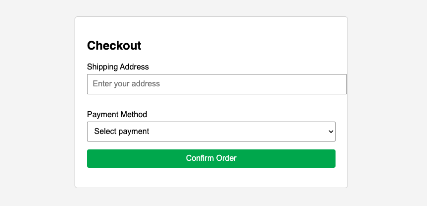

<h1>
  <span class="headline">Selenium: Page Object Model</span>
  <span class="subhead">Implementing Reusable Page Methods</span>
</h1>

**Learning Objective:** Implement reusable page methods for common user interactions (such as login or checkout).

## Why name your methods like real actions?

When you read test code, you want to instantly understand what’s happening. That’s why your Page Object methods should describe what a user is doing—not how the code works behind the scenes.

For example:

```python
def sign_in(self, username, password):
    # Types into fields and clicks the sign-in button
```

This is clear. You immediately know this method signs in a user.

Compare that to something vague like:

```python
def process_form(self):
    # What kind of form? What does it do?
```

> 💡 Name your methods after user actions like `sign_in`, `add_to_cart`, or `place_order`—not technical descriptions. It helps everyone (including future you) understand your tests quickly.

## Combine multi-step actions into one method

Sometimes a task takes several steps. For example, placing an order might require:

- Typing a shipping address
- Selecting a payment method
- Clicking “Confirm”

Rather than repeating all those lines in every test, create one method to wrap the flow:

```python
def complete_checkout(self, address, payment_method):
    self.enter_shipping_address(address)
    self.choose_payment_method(payment_method)
    self.confirm_order()
```

Now your test just says:

```python
checkout_page.complete_checkout("123 Main St", "Visa")
```

> 😎 By grouping the steps together, you shield your tests from the details. If the checkout flow changes, update one method—not every test.

Think of each method like a recipe step. Instead of rewriting every action, you reuse the instructions—clear and consistent.

## Add waits inside your methods—not your tests

Dynamic websites often delay showing elements. If your test clicks too early, it fails.

Instead of writing `WebDriverWait` in every test, build those waits into your Page Object methods:

```python
from selenium.webdriver.support.ui import WebDriverWait
from selenium.webdriver.support import expected_conditions as EC

def click_sign_in(self):
    WebDriverWait(self.driver, 10).until(
        EC.element_to_be_clickable(self.SIGNIN_BUTTON)
    ).click()
```

Now every time you call `click_sign_in()`, it waits automatically.

> 🏆 Best practice: Encapsulate synchronization. By handling waits inside your Page Object methods, every test benefits from fewer flaky failures and less repeated code.

## When to return another Page Object

In many web applications, an action on one page leads to another.

If a user action brings you to a new page (like signing in and landing on a dashboard), your method should return the next Page Object.

```python
def sign_in(self, username, password):
    self.enter_username(username)
    self.enter_password(password)
    self.click_sign_in()
    return DashboardPage(self.driver)
```

Your test can now chain the actions naturally:

```python
dashboard = login_page.sign_in("asha", "s3cur3-p455w0rd")
dashboard.assert_greeting_present()
```

> 💡 This matches how real users flow from one screen to another. It also keeps your test code focused and easy to follow.

## Best practices: Keep methods simple and reusable

Follow these tips to write methods that work across many tests:

- Make method names match real tasks (ex: `sign_in`, not `submit_form`).
- Use arguments, not hardcoded values.
- Use small helper methods for internal steps (like `_fill_username_field`) if needed.
- Return a new Page Object if your method navigates to a different page.

> 🧰 Think of your Page Object methods as tools. The clearer and more flexible each tool is, the better your test suite will work.

<div class="activity guided-walkthrough">
  <h2 class="title">Build a Reusable Checkout Page Object</h2>
  <span class="minutes">10 min</span>
</div>

Practice creating a reusable Page Object Model (POM) class for a multi-step checkout flow, using structured page methods and encapsulated waits.

**For this exercise, use the 📄 `checkout_page.html` file created during setup.**



<br>

1. **Create a new file named 📄 `checkout_page.py`.**

2. In this file, build a `CheckoutPage` class using the example below.

This class includes:

- Defined selectors (as class constants)
- Synchronized methods for each major interaction
- A combined method to perform the full checkout flow

```python
from selenium.webdriver.common.by import By
from selenium.webdriver.support.ui import WebDriverWait
from selenium.webdriver.support import expected_conditions as EC

# This class represents the checkout page in a web application
# It follows the Page Object Model (POM) structure to organize locators and actions
class CheckoutPage:
    # Step 1: Define locators for the key elements on the page
    SHIPPING_INPUT = (By.ID, "shipping-address")       # Input field for shipping address
    PAYMENT_DROPDOWN = (By.ID, "payment-method")       # Dropdown menu to select payment type
    CONFIRM_BUTTON = (By.ID, "confirm-order")          # Button to confirm and complete the order

    def __init__(self, driver):
        # Step 2: Store the WebDriver so we can use it in all methods
        self.driver = driver

    def enter_shipping_address(self, address):
        # Step 3: Wait for the shipping input field to appear, then type in the address
        WebDriverWait(self.driver, 10).until(
            EC.visibility_of_element_located(self.SHIPPING_INPUT)
        ).send_keys(address)

    def choose_payment_method(self, method):
        # Step 4: Wait until the dropdown is clickable, then open it
        dropdown = WebDriverWait(self.driver, 10).until(
            EC.element_to_be_clickable(self.PAYMENT_DROPDOWN)
        )
        dropdown.click()

        # Step 5: After the dropdown is open, select the option matching the method text
        option = self.driver.find_element(By.XPATH, f"//option[text()='{method}']")
        option.click()

    def confirm_order(self):
        # Step 6: Wait until the confirm button is clickable, then click it
        WebDriverWait(self.driver, 10).until(
            EC.element_to_be_clickable(self.CONFIRM_BUTTON)
        ).click()

        # Step 7: After clicking, the user is taken to the receipt page
        # (This assumes there is a separate ReceiptPage class)
        return ReceiptPage(self.driver)

    def complete_checkout(self, address, method):
        # Step 8: Combine all the above steps into one method to complete the whole checkout process
        self.enter_shipping_address(address)
        self.choose_payment_method(method)
        return self.confirm_order()
```

1.  Write your test script

    - **Create a new 📄 `checkout_page_test.py` test file.**
    - Use this template to call your Page Object class:

```python
from selenium import webdriver
from checkout_page import CheckoutPage

driver = webdriver.Chrome()
driver.get("file:///Users/username/path/to/example_file.html") # Replace with the full absolute path to your local HTML file

checkout_page = CheckoutPage(driver)
receipt_page = checkout_page.complete_checkout("221B Baker Street", "UnionPay")

# (Optional) Add a follow-up assertion here once ReceiptPage is implemented
# Example: assert receipt_page.get_confirmation_message() == "Thank you for your order!"

driver.quit()
```

## Debrief

- What part of the POM class felt most useful?
- How does this pattern help you scale your test suite for future changes?
- What challenges might come up when applying this to more complex flows?

## Knowledge check

❓ Which of the following is the main benefit of placing waits and synchronization inside Page Object methods, instead of in each test script?

- A) Tests always run faster regardless of web application speed.
- B) All tests benefit from more reliable actions without repeated code.
- C) It allows hardcoding of user data into each method.
- D) It hides page actions from other developers.

❓ When should a Page Object method return another Page Object?

- A) When data needs to be logged to the console.
- B) When the method causes navigation to a different page.
- C) Only when the test has failed.
- D) When waiting for a popup to close.
