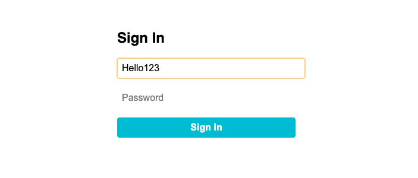

<h1>
  <span class="headline">Selenium: Page Object Model</span>
  <span class="subhead">Refactoring Tests with Page Objects</span>
</h1>

**Learning Objective:** Refactor an existing test by separating selectors and logic into a PageObject class.

## Analyzing an existing Selenium test script

Many automation testers begin their journey by writing Selenium tests in a direct, step-by-step style, putting all selectors and actions directly within the test itself. This approach can feel accessible, especially when you are managing a small suite of tests.

**Let’s look again at a common example for a login feature:**

```python
from selenium import webdriver
from selenium.webdriver.common.by import By

driver = webdriver.Chrome()
driver.get("https://demo-app.com/login")

driver.find_element(By.ID, "user").send_keys("beginner123")
driver.find_element(By.ID, "pass").send_keys("password")
driver.find_element(By.ID, "signin").click()
# Further test logic here, for example:
# assert driver.find_element(...).text == "Welcome back!"
driver.quit()
```

This style is understandable at first glance. But as soon as your application or test suite grows, maintaining these tests can become challenging.

### Why this can cause issues as your test suite grows

If the sign-in button’s ID ever changes from `"signin"` to `"login-button"`, you would need to hunt through every test script to update it. This leads to:

- Increased maintenance effort
- Potential for mistakes and missed updates
- Frustration as your application evolves

This highlights a key need: a more organized, maintainable approach.

## Identifying page elements and actions

Let’s learn how to start organizing our scripts for better clarity and reusability.

First, break down your existing script into:

- **Elements (selectors):**

  - Username field: `By.ID, "user"`
  - Password field: `By.ID, "pass"`
  - Sign-in button: `By.ID, "signin"`

- **Actions:**
  - Entering the username
  - Entering the password
  - Clicking sign-in

By grouping related elements and their possible actions, you set the foundation for transforming scripts into Page Objects.

## Creating a PageObject class structure

A Page Object is a dedicated Python class representing everything you need to interact with a specific page in your web application.

Your class will include:

- Class variables for element locators (selectors)
- An `__init__` method to store a reference to the Selenium driver
- Methods for user actions (such as typing a username, entering a password, clicking a button)

```python
from selenium.webdriver.common.by import By

class LoginPage:
    USERNAME_INPUT = (By.ID, "user")
    PASSWORD_INPUT = (By.ID, "pass")
    SIGNIN_BUTTON = (By.ID, "signin")

    def __init__(self, driver):
        self.driver = driver

    def enter_username(self, username):
        self.driver.find_element(*self.USERNAME_INPUT).send_keys(username)

    def enter_password(self, password):
        self.driver.find_element(*self.PASSWORD_INPUT).send_keys(password)

    def click_signin(self):
        self.driver.find_element(*self.SIGNIN_BUTTON).click()

    def login(self, username, password):
        self.enter_username(username)
        self.enter_password(password)
        self.click_signin()
```

> 📚 A _Page Object_ is a class that defines all the elements and actions for a particular web page, helping keep your tests clean and focused.

## 1. Moving selectors into the PageObject

By placing all selectors at the top of your Page Object as constants, you ensure that future changes to your web page mean changing the locator only once — inside your Page Object class — and not throughout multiple test files.

```python
class LoginPage:
    USERNAME_INPUT = (By.ID, "user")
    PASSWORD_INPUT = (By.ID, "pass")
    SIGNIN_BUTTON = (By.ID, "signin")
    # ... rest of the class
```

> 🏆 This is a best practice in test automation: centralize locators and user interactions for better maintainability.

## 2. Refactoring test logic to use PageObject methods

Let’s see the benefit of Page Objects in action by updating your test script. After refactoring, your test focuses on _what_ you want to achieve, not the details of _how_ each interaction happens.

```python
from selenium import webdriver
from login_page import LoginPage

driver = webdriver.Chrome()
driver.get("https://demo-app.com/login")

login_page = LoginPage(driver)
login_page.login("beginner123", "password")

# Continue with further test assertions

driver.quit()
```

By working with the `LoginPage` class, the login flow becomes a single, memorable action. If your username field changes, you update only one place — the class locator.

> 💡 This approach is like using a map instead of turn-by-turn directions written from memory. When a road changes (the UI changes), you update the map, and every journey (test) automatically takes the new route.

### Why does this help?

- Centralized updates: Update element locators once, in a single class.
- Simpler test logic: Tests read more like a set of instructions (“log in”), increasing clarity for you and your team.
- Flexibility: If your login process becomes more complex (such as adding a CAPTCHA step), you can enhance the `LoginPage` only — not every test that logs in.

<div class="activity solo-exercise">
  <h2 class="title">Refactor a sign-in test using POM</h2>
  <span class="minutes">15 min</span>
</div>

Let's explore how refactoring a procedural Selenium test into a Page Object Model class makes test organization and maintenance simpler, clearer, and more scalable.

1. **Solo or team up with a partner.**

**For this exercise, use the 📄 `sign_in.html` file created during setup.**



<br>

2. **Create a new 📄 `sign_in_page_test.py` test file and start with the following _procedural_ test script:**

```python
from selenium import webdriver
from selenium.webdriver.common.by import By

driver = webdriver.Chrome()
driver.get("file:///Users/username/path/to/example_file.html") # Replace with the full absolute path to your local HTML file

driver.find_element(By.ID, "user").send_keys("beginner123")
driver.find_element(By.ID, "pass").send_keys("password")
driver.find_element(By.ID, "signin").click()
# Test continues...
driver.quit()
```

3. **Refactor this code using the Page Object Model:**

   - Create a file named `sign_in_page.py` for your `SignInPage` class.
   - Move all selectors (locators) and related actions into methods inside the `SignInPage` class.
   - Update your test script to import and use `SignInPage` to perform login actions.

**Let's step through the POM pattern together:**

```python
from selenium.webdriver.common.by import By

# This class represents the "Sign In" page of a web application
# It uses the Page Object Model (POM) pattern to group selectors and actions in one place
class SignInPage:
    # Define locators for important elements on the sign-in page
    USERNAME_INPUT = (By.ID, "user")      # Locator for the username input field
    PASSWORD_INPUT = (By.ID, "pass")      # Locator for the password input field
    SIGNIN_BUTTON = (By.ID, "signin")     # Locator for the "Sign In" button

    def __init__(self, driver):
        # Store the WebDriver instance so we can use it in our methods
        self.driver = driver

    # Create method to type the username into the input field
    def enter_username(self, username):
        self.driver.find_element(*self.USERNAME_INPUT).send_keys(username)

    # Create method to type the password into the input field
    def enter_password(self, password):
        self.driver.find_element(*self.PASSWORD_INPUT).send_keys(password)

    # Create method to click the "Sign In" button
    def click_signin(self):
        self.driver.find_element(*self.SIGNIN_BUTTON).click()

    # Create combined method to sign in using a username and password
    def sign_in(self, username, password):
        self.enter_username(username)
        self.enter_password(password)
        self.click_signin()
```

**Now refactor your `sign_in_page_test.py` test file, to use the new class:**

```python
from selenium import webdriver
from sign_in_page import SignInPage

driver = webdriver.Chrome()
driver.get("file:///Users/username/path/to/example_file.html") # Replace with the full absolute path to your local HTML file

sign_in_page = SignInPage(driver)
sign_in_page.sign_in("beginner123", "password")
# Continue your test here
driver.quit()
```

4. **Test your refactored scripts** to ensure they work as expected.

<div class="activity discussion">
  <h2 class="title">Consider the following...</h2>
  <span class="minutes">3 min</span>
</div>

- How did organizing selectors and actions into Page Objects affect your understanding of the test flow?
- If your application’s login button selector changed tomorrow, what would you do differently now versus before this exercise?
- Can you imagine any pages or components in your own projects that could benefit from a similar approach? If so, what challenges or benefits do you anticipate?
